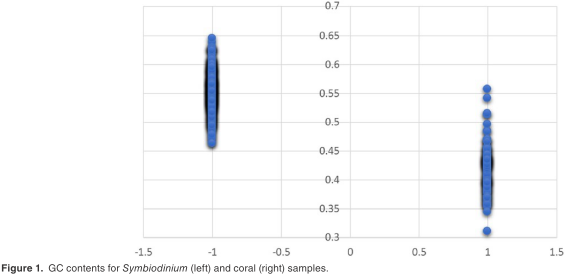
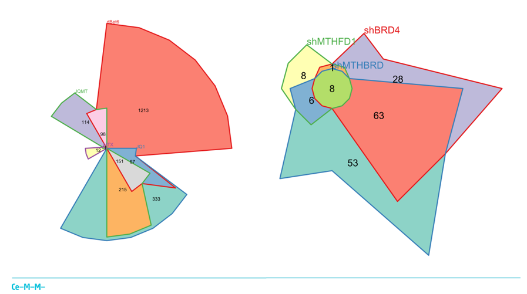

class: middle
```{r setup, include=FALSE}
options(htmltools.dir.version = FALSE)
knitr::opts_chunk$set(fig.retina = 3, warning = F, message = F)
```

```{r xaringan-themer, include = FALSE}
library(xaringanthemer)
mono_light(
  base_color = "#1c5253",
  header_font_google = google_font("Josefin Sans"),
  text_font_google   = google_font("Montserrat", "300", "300i"),
  code_font_google   = google_font("Droid Mono")
)

#
library(ggplot2)
```

```{r github, echo = FALSE, out.width = '85%'}

```

---
class: middle, center, inverse
## Dalhousie University

---
class: middle, center

.pull-left[
```{r snail-01, echo=F, out.width = '100%'}

```
]

.pull-right[
```{r snail-02, echo=F, out.width = '80%'}
knitr::include_graphics("figures/estradiol.jpg")
```
]
---
class: middle, center
.pull-left[
```{r snail-03, echo=F, out.width = '100%'}

```
]

.pull-right[
```{r snail-04, echo=F, out.width = '100%'}

```
]
---
class: middle, center, inverse
## Computer Vision
---
class: middle, center
```{r sponge-01, echo=FALSE, out.width = '100%'}

```

---
class: middle, center

```{r rov, echo=FALSE, out.width = '100%'}

```

---
class: middle, center

```{r sponge-02, echo=FALSE, out.width = '100%'}
knitr::include_graphics("figures/glass-sponge-01.jpg")
```

---
class: middle, center

```{r sponge-03, echo=FALSE, out.width = '100%'}

```

---
class: middle, center

```{r sponge-04, echo=FALSE, out.width = '160%'}

```

---
class: middle, center, inverse
## University of Calgary

---
class: middle, center
```{r sponge-spawn, echo=FALSE, out.width = '100%'}

```
---
class: middle, center

```{r vize-01, echo=FALSE, out.width = '85%'}

```
---
class: middle, center

```{r vize-02, echo=FALSE, out.width = '100%'}

```
---
class: middle, center

```{r vize-03, echo=FALSE, out.width = '100%'}

```
---
class: middle, center

```{r viz-04, echo=FALSE, out.width = '80%'}
knitr::include_graphics("figures/coral-fig2.png")
```

---
class: middle, center

```{r vize-05, echo=FALSE, out.width = '250%'}

```
---
class: middle, center

```{r vize-06, echo=FALSE, out.width = '100%'}

```
---
class: middle, center

```{r vize-07, echo=FALSE, out.width = '80%'}

```

---
class: middle, center



---
class: middle, center, inverse
## Ce-M-M Reserch Center for Molecular Medicine

---
class: middle, center
```{r kubicek-01, echo=FALSE, out.width = '100%'}

```
---
class: middle, center
```{r kubicek-02, echo=FALSE, out.width = '100%'}

```
---
class: middle, center
```{r kubicek-022, echo=FALSE, out.width = '100%'}

```
---
class: middle, center
```{r kubicek-03, echo=FALSE, out.width = '100%'}

```
---
class: middle, center
```{r kubicek-033, echo=FALSE, out.width = '100%'}

```
---
class: middle, center
```{r kubicek-04, echo=FALSE, out.width = '100%'}

```
---
class: middle, center
```{r kubicek-05, echo=FALSE, out.width = '70%'}

```
---
class: middle, center, inverse
## Douglas Mental Health University Institute
---
class: middle, center
```{r meaney-0, echo=FALSE, out.width = '90%'}

```
---
class: middle, center
```{r meaney-00, echo=FALSE, out.width = '90%'}

```
---

class: middle, center
```{r meaney-01, echo=FALSE, out.width = '90%'}

```
---
class: middle, center

```{r meaney-02, echo=FALSE, out.width = '100%'}
knitr::include_graphics("figures/report-02.gif")
```
---
class: middle, center

```{r meaney-03, echo=FALSE, out.width = '100%'}
knitr::include_graphics("figures/report-01.gif")
```
---
class: middle, center

Optimising code to make it run faster is an iterative process:

+ Find the biggest bottleneck (the slowest part of your code)
+ Try to eliminate it (you may not succeeed but that's ok)
+ Repeat until your code is "fast enough"

```{r optimize, echo=FALSE, out.width = '100%', eval = F}
knitr::include_graphics("figures/optimize.PNG")
```
---
class: middle, center

```{r meaney-04, echo=FALSE, out.width = '75%'}

```
---
class: center, middle

.pull-left[
```{r meaney-05, echo=FALSE, out.width = '160%'}

```
]

.pull-right[
```{r meaney-06, echo=FALSE, out.width = '100%'}

```
]
---
class: center, middle

.pull-left[
```{r meaney-07, echo=FALSE, out.width = '100%'}

```
]

.pull-right[
```{r meaney-08, echo=FALSE, out.width = '100%'}

```
]

---
class: center, middle

### R for-loops are slow!

```{r for-loop, echo=FALSE, out.width = '100%'}

```
---
class: center, middle

### Transpile to faster language, like C++ (Rcpp)
.pull-left[
```{r meaney-10, echo=FALSE, out.width = '100%'}

```
]

.pull-right[
```{r meaney-11, echo=FALSE, out.width = '100%'}

```
]
---
class: center, middle
```{r dev = 'svg', dev.args = list(bg = "transparent"), echo=FALSE}
invthm <- theme_bw() + 
  theme(
    panel.background = element_rect(fill = "transparent", colour = NA), 
    plot.background = element_rect(fill = "transparent", colour = NA),
    legend.background = element_rect(fill = "transparent", colour = NA),
    legend.key = element_rect(fill = "transparent", colour = NA),
    text = element_text(colour = "black", size = 10),
    axis.text = element_text(colour = "black", size = 10)
  )
```

```{r, echo=F, message=F, error=F,warning=F}
library(magrittr)
library(tibble)
library(dplyr)
library(ggplot2)

df <- tibble(size_in_gb = c(rep(0.171,2), rep(1.7,2), rep(15,2), rep(23,2), rep(32,2)), method = rep(c("for loop", "Rcpp"), 5), time_each_minutes = c(3.84, 0.32, 48.63, 2.89, 377, 23.96, 661.35, 40, 1007, 60))
# Times were divided by repitions and 60 seconds to get time in minutes

plot01 <- ggplot(data=df, aes(x=size_in_gb, y=time_each_minutes, group=method)) +
  geom_line(aes(color=method), size = 1.5) +
  geom_point(aes(color=method), size = 4) +
  labs(x="Size of .gen file (Gb)", y = "Time (in minutes)") +
  scale_color_manual(values=c("#999999", "#E69F00"))
```

```{r, dev = 'svg', dev.args = list(bg = "transparent"), echo=F}
plot01 + invthm
```
---
class: middle, center
```{r meaney-12, echo=FALSE, out.width = '100%'}
knitr::include_graphics("figures/dependency.png")
```
---
class: middle, center, inverse
## Side-projects
---

class: middle, center
.pull-left[
```{r viz-01, echo=FALSE, out.width = '100%'}

```
]
.pull-right[
```{r viz-02, echo=FALSE, out.width = '100%'}

```
]

---
class: middle, center
## <code><font color="black">vapoRwave</font></code> theme 📦


---
class: center, middle, inverse

## Thanks!

Slides created via the R package <code><font color="black">xaringan</font></code> which is powered by <code><font color="black">reactjs</font></code>.

Twitter: <code><font color="black">@MattOldach</font></code>[**@MattOldach**](https://twitter.com/MattOldach)

Website: <code><font color="black">moldach.github.io</font></code>